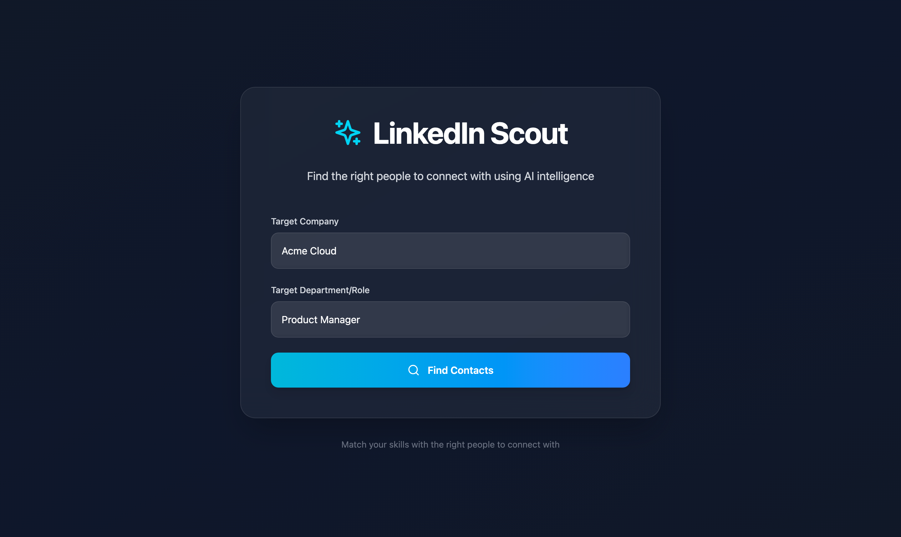
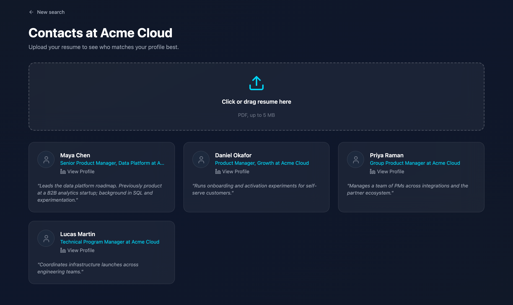
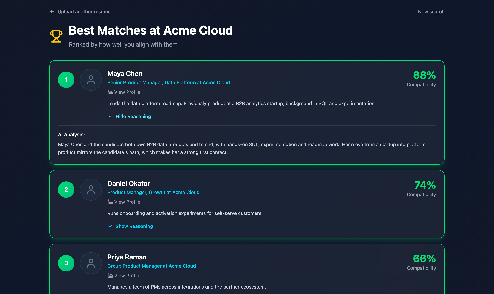
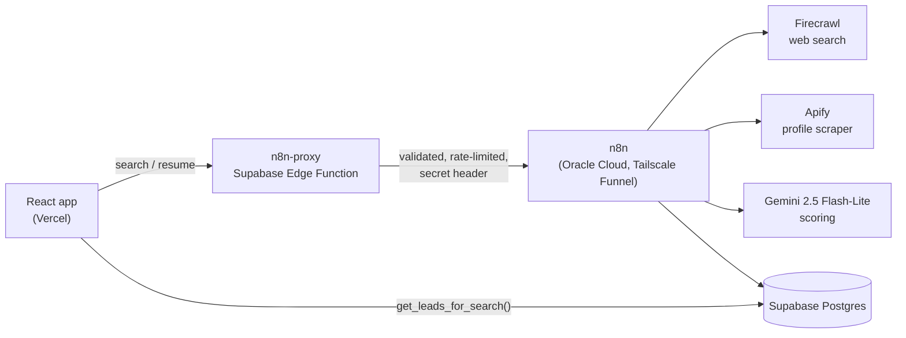

# LinkedIn Scout

Find the right people to reach out to at a company, ranked by how well their background matches your resume.

[](https://github.com/rishav-dutta/linkedin-scout/actions/workflows/ci.yml)
[](LICENSE)

**[Open the app](https://rishav-linkedin-scout.vercel.app)** · **[Project site](https://rishav-dutta.github.io/linkedin-scout/)**



## What it does

1. **Search.** Enter a company and a role, for example "Airtable" and "Product Manager".
2. **Discover.** LinkedIn profiles of people in that role appear within about a second. Full profiles and photos load in the background.
3. **Rank.** Upload your resume (PDF). Gemini scores every contact from 0 to 100 against it and explains each score.

| Contacts | Ranked matches |
|---|---|
|  |  |

<sub>Screenshots use sample data.</sub>

## How it works



**Search** (`find-leads`): the gatekeeper function checks the input and rate limits, then calls n8n. n8n runs a web search for public LinkedIn profiles, saves the people it finds and replies to the site straight away. It then scrapes their full profiles with Apify (7–35 s) and saves them, with each person's current profile URL. The site shows contacts immediately and unlocks the resume upload once the profiles have arrived.

**Scoring** (`score-resume`): n8n extracts the resume's text and sends it to Gemini with the search's profiles, each labelled by its database ID. Gemini returns a score and reasoning per ID. Only IDs that were sent are accepted, and the scores are saved.

## Engineering highlights

- **No secrets or open endpoints in the browser.** The site talks to a Supabase Edge Function, which validates input (text length, PDF type and size), rate-limits per visitor and per day, and forwards to n8n with a secret header. The n8n webhooks reject anything else.
- **Locked-down data.** Leads are read through a `security definer` function that returns only one search's rows and only the columns the UI needs. The table itself has no public read policy. Uploaded resumes go to a private storage bucket.
- **Fast first paint.** Apify is over 90% of a search's time, so the workflow replies as soon as the web search results are saved. Contacts appear in about a second instead of 7–35 s.
- **Robust to real-world data.** Profiles are matched on the exact URL sent to the scraper, so people who renamed their LinkedIn URL are still found. Gemini identifies leads by ID instead of copying URLs it could mistype. Searches with no results get a clear message, and the model's occasional empty replies are retried.
- **Free to run.** n8n runs on Oracle Cloud's Always Free tier behind a Tailscale Funnel URL. Supabase and Vercel are on free plans, and a scheduled workflow keeps the Supabase project from pausing. Monthly n8n backups are copied off the server.
- **Reproducible.** Database migrations rebuild the schema from scratch, the n8n workflows are exported in [`n8n/workflows`](n8n/workflows), and CI runs lint, type checks and a build on every pull request.

## Tech stack

| Layer | Technology |
|---|---|
| Frontend | React 18, TypeScript, Vite 8, Tailwind CSS 4, Framer Motion, on Vercel |
| API gateway | Supabase Edge Function (Deno) |
| Workflows | n8n 2.41, self-hosted in Docker on Oracle Cloud (Ampere A1, Always Free) |
| Data | Supabase Postgres and Storage |
| Search and scraping | Firecrawl (web search), Apify ([harvestapi/linkedin-profile-scraper](https://apify.com/harvestapi/linkedin-profile-scraper)) |
| AI | Google Gemini 2.5 Flash-Lite through the n8n AI Agent, with structured output |

## Repository layout

```
src/                         React app
supabase/migrations/         Database schema, policies and the get_leads_for_search function
supabase/functions/n8n-proxy Edge Function between the site and n8n
n8n/workflows/               Exported n8n workflows (see n8n/README.md)
docs/                        Project site (GitHub Pages)
```

## Run it yourself

You need a Supabase project, an n8n instance, and Firecrawl, Apify and Gemini API keys.

1. **Database.** Apply the files in `supabase/migrations/` in order (`supabase db push`, or paste them into the SQL editor).
2. **Edge Function.** Add your site's address to `ALLOWED_ORIGINS` in `supabase/functions/n8n-proxy/index.ts`, then deploy it and set its secrets:
   ```sh
   supabase functions deploy n8n-proxy
   supabase secrets set N8N_BASE_URL=https://your-n8n-host N8N_PROXY_SECRET=a-long-random-string
   ```
3. **n8n.** Import the three workflows and create their credentials, following [`n8n/README.md`](n8n/README.md).
4. **Frontend.**
   ```sh
   cp .env.example .env.local   # add your Supabase URL and anon key
   npm ci
   npm run dev                  # http://localhost:5173
   ```
   `npm run lint`, `npm run typecheck` and `npm run build` are the same checks CI runs.

## Limits

- Searches look for US-based profiles and return up to 4 people.
- Each visitor can run 5 searches and 10 resume uploads per hour (50 and 100 per day across all visitors), to protect the API credits behind the demo.
- Uploaded resumes are stored in a private bucket.

## License

[MIT](LICENSE)
